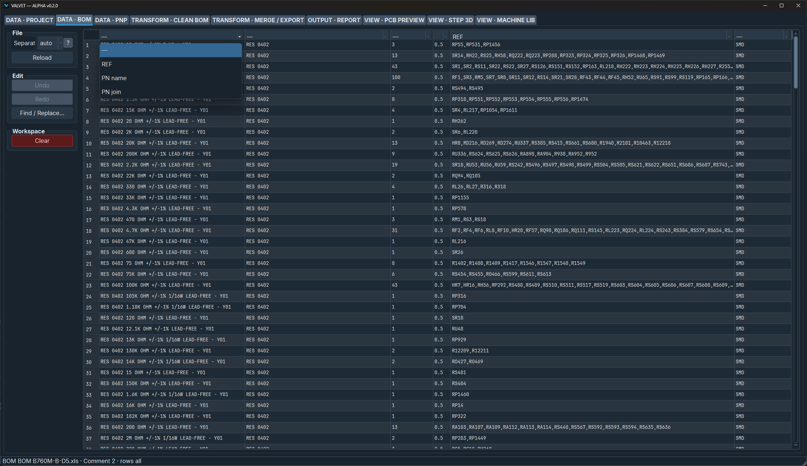
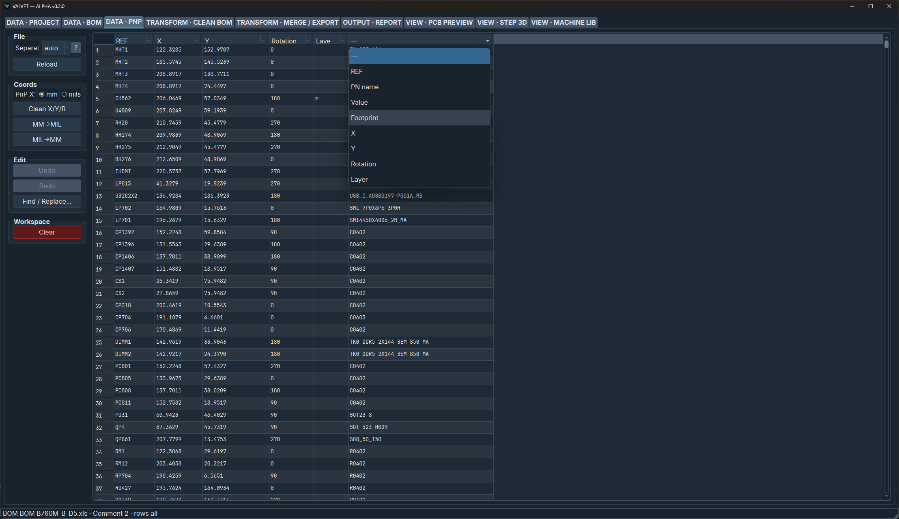
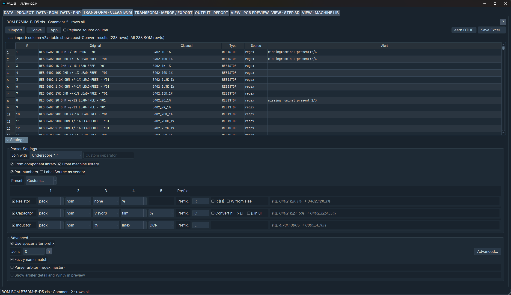
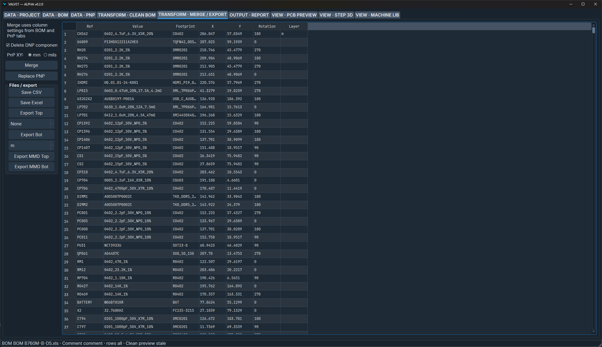
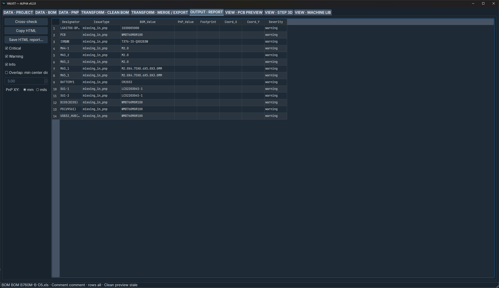
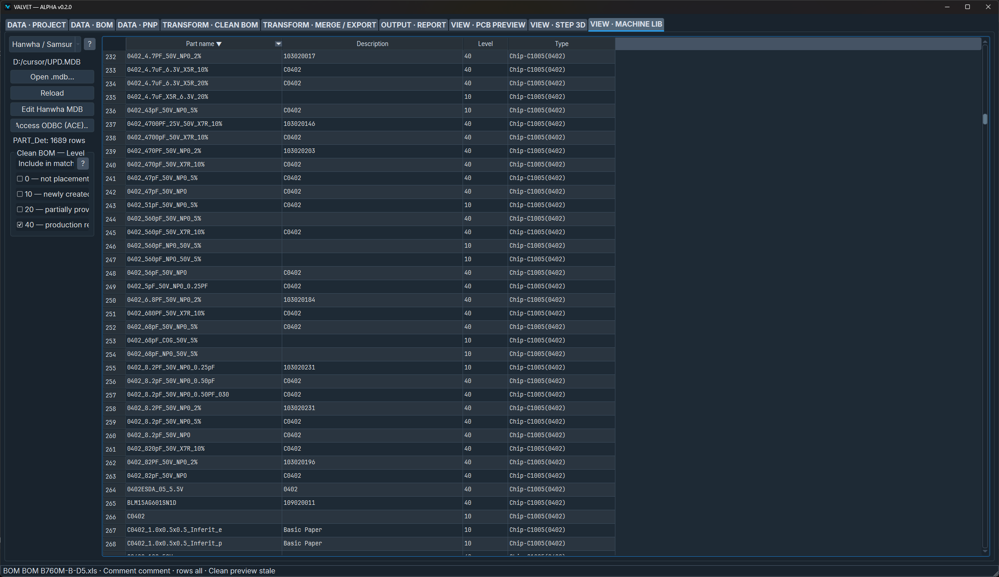

# VALVET — ALPHA v0.2.0

**English** | [Русский](README.ru.md)

<p align="center">
  
</p>

Desktop app (PySide6) for SMT prep: open a **BOM** and a **pick-and-place** file, clean part names, check they match, merge, export for the line.

Repo: [zhoel-sherk/VALVET](https://github.com/zhoel-sherk/VALVET). Own project (not a GitHub fork of [marmidr/boomer](https://github.com/marmidr/boomer)). **ALPHA** — Hanwha MDB edit, PCB Preview, and Step 3D are still rough.

## Screenshots

<table>
<tr>
<td width="50%" valign="top">

<p><em>DATA — BOM</em></p>
</td>
<td width="50%" valign="top">

<p><em>DATA — PnP</em></p>
</td>
</tr>
<tr>
<td width="50%" valign="top">

<p><em>TRANSFORM — Clean BOM</em></p>
</td>
<td width="50%" valign="top">

<p><em>TRANSFORM — Merge / Export</em></p>
</td>
</tr>
<tr>
<td width="50%" valign="top">

<p><em>OUTPUT — Report</em></p>
</td>
<td width="50%" valign="top">

<p><em>VIEW — Machine lib</em></p>
</td>
</tr>
</table>

## Install: Windows zip (no Python)

1. Download [VALVET-0.2.0-windows-x64.zip](https://github.com/zhoel-sherk/VALVET/releases/download/v0.2.0/VALVET-0.2.0-windows-x64.zip) from [release v0.2.0](https://github.com/zhoel-sherk/VALVET/releases/tag/v0.2.0).
2. Unzip. Run `VALVET\VALVET.exe` (keep the `_internal` folder next to the exe).
3. Copy the whole folder if you put it on a USB stick.

Community WinGet id **ZhoelSherk.VALVET** is submitted; use the zip until that PR is merged. The zip has **no** `examples/`, no Access ODBC, no pythonocc.

## Install: from this repo (developers)

Python **3.10+**. In the clone root (same folder as `requirements.txt`):

```powershell
python -m venv .venv
.\.venv\Scripts\Activate.ps1
python -m pip install -r requirements.txt
$env:PYTHONPATH = "src"
python src/main.py
```

Linux / macOS:

```bash
python3 -m venv .venv
source .venv/bin/activate
python -m pip install -r requirements.txt
PYTHONPATH=src python src/main.py
```

`--debug` writes logs like the Project tab “Debug logs” checkbox. Optional fonts: `python tools/fetch_inter.py` and `python tools/fetch_jetbrains_mono.py`. Tests: [doc/info/TESTING.md](doc/info/TESTING.md).

## Example: first board (from repo)

Files in `examples/example1/`.

1. **DATA — BOM** → open `Kaseta_2v1 BOM_results.txt`. In the header combos set **REF** and **Comment** (part name). Use **PnJoin** only if a second column should be glued onto the name after Clean.
2. **DATA — PnP** → open `Pick Place for Kaseta2v1(Standard).csv`. Map **REF**, **X**, **Y**, **Rotation**, **Layer** (and **Comment** / footprint if present).
3. **TRANSFORM — Clean BOM** → Parser Settings if needed → Convert. Apply cleaned names back to the BOM.
4. **OUTPUT — Report** → cross-check (missing refs, comment mismatch, stacked XY).
5. **TRANSFORM — Merge / Export** → Merge → Export CSV/XLSX or **Export Top** / **Export Bot**.

Other sample files:

| Folder | What |
| --- | --- |
| `examples/example2/` | BOM `.csv` + PnP `.txt` |
| `examples/example3/` | PnP `.csv` |
| `examples/mmd/` | Mercury-style `.mmd` export goldens |
| `examples/gerber_example3/` | Gerbers for **VIEW — PCB Preview** |
| `examples/UPD.MDB` | Hanwha shop DB for **VIEW — Machine lib** (Windows: ACE ODBC for in-place save) |

`components.txt` in the repo root is the sample / user part list (override with env `BOOMER_COMPONENTS_TXT`).

## Tabs (short)

| Group | Tab | Does |
| --- | --- | --- |
| DATA | Project | Profile, UI language (`lang/`), session |
| DATA | BOM / PnP | Load `.xls` `.xlsx` `.csv` `.ods` `.txt` `.tab`, map columns, edit, autosave |
| TRANSFORM | Clean BOM | R/C/L decode + regex; vendor PNs (Yageo, Murata, …) |
| TRANSFORM | Merge / Export | Join BOM onto PnP; Top/Bot / `.mmd` |
| OUTPUT | Report | BOM vs PnP checks |
| VIEW | PCB Preview | Gerber + PnP overlay (WIP) |
| VIEW | Step 3D | `.stp` / `.step` — extra packages, see below |
| VIEW | Machine lib | Hanwha `.mdb` (WIP); Yamaha later |

Settings live under organization **VALVET**. Profiles save mapping/options, not which files were open. Window size and last Browse folder are global.

Optional Step 3D: `pip install -r requirements-step3d.txt`, tessellation `requirements-step3d-occ.txt` (conda-forge `pythonocc-core` on Windows). Or set an external STEP→OBJ command in Debug.

No-Qt CLI: `pip install -r requirements-cli.txt` then `PYTHONPATH=src python -m cli --help`.

## More

Roadmap: [doc/TODO.md](doc/TODO.md). Frozen Windows build: [doc/info/PACKAGING_WINDOWS.md](doc/info/PACKAGING_WINDOWS.md). License: [MIT](LICENSE).

<p align="center">
  
</p>
