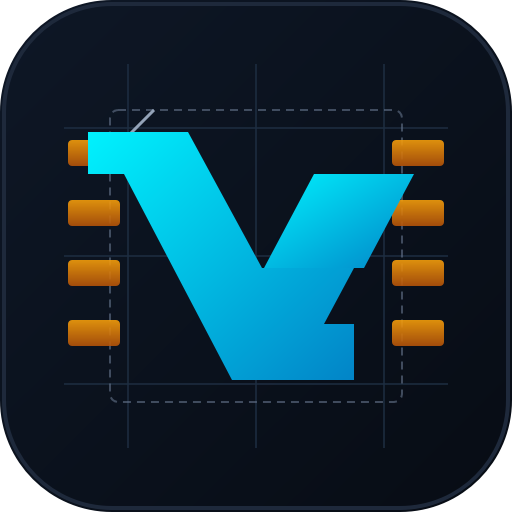

# VALVET — **ALPHA v0.1.3**

<p align="center">
  
</p>
<p align="center">
  
</p>

**VALVET** (*Validator And Line-Verified Export Tool*) is a standalone PySide6 desktop app for electronics production: load BOM and Pick-and-Place files, clean component names, cross-check BOM/PnP consistency, and export machine-oriented placement data.

Home: [zhoel-sherk/VALVET](https://github.com/zhoel-sherk/VALVET). This is **not** a GitHub fork of [marmidr/boomer](https://github.com/marmidr/boomer); the codebase has diverged enough to live as its own project.

**ALPHA v0.1.3** is developed on GitHub branch **`main`**.

## Current Status

The primary application is the PySide6 desktop UI:

```bash
cd VALVET
source .venv/bin/activate   # Windows: .venv\Scripts\Activate.ps1
python src/main.py
python src/main.py --debug   # same as Project tab “Debug logs”: file + stderr logging
```

Alias (deprecated import path): `python src/app_pyside6.py`

**Optional CLI / Textual TUI** (no Qt, no Step 3D, no PCB Preview): install `requirements-cli.txt` and run `PYTHONPATH=src python -m cli --help`. Subcommands load BOM/PnP, map columns, clean comments, merge/export, and read Hanwha `.mdb` tables / `PART_Det`. `python -m cli tui` opens a one-screen Textual app. Session JSON stores paths and mappings only; DataFrames stay in the process. `python -m cli --debug …` or `VALVET_DEBUG=1` enables the same `logger.config` file/stderr logging as the desktop `--debug` flag.

**ALPHA:** Expect rough edges. Hanwha MDB edit, **PCB Preview**, and **Step 3D** (VTK) are especially experimental. `QSettings` uses organization **`VALVET`** / application **`VALVET`**.

**UI profiles:** On the Project tab you can pick a **profile** (`default` or cloned names). Checkboxes, combos, and tab options for BOM/PnP (except which file is open), Clean, Merge, Report, and PCB Preview **mirror/units/nudge** are saved into the active profile when you **close the app**. **Step 3D** converter command (`step_3d/converter_command`) and tessellation deflection (`step_3d/lin_deflection`) are stored in **global** `QSettings`, not inside profile JSON. **Loaded BOM/PnP file paths are not restored** after restart (hash-keyed options still apply when you open the same path again). Use **Clear** on the BOM or PnP tab to unload a file from the workspace without changing saved profile defaults.

**UI language:** The Project tab **Language** control loads JSON catalogs from `lang/` — English, Русский, Polski, 中文 (Simplified Chinese), Deutsch, and Português (Brasil). Choice is stored in `QSettings` and in the active profile. Tab-specific controls beyond the shared catalog may still appear in English until those strings are moved into the same i18n system.

**Automated startup smoke:** `pytest tests/test_app_startup.py` (headless, `QT_QPA_PLATFORM=offscreen`) checks that the main window and all standard tabs construct without exceptions; see [TESTING.md](doc/info/TESTING.md) Level 1b.

**Window and dialogs:** The main window **size and position**, **active tab**, and the **last folder** used for BOM/PnP **Browse** persist globally (not inside profile JSON). PCB Preview remembers the last folder for **Add Gerber layer**.

### PCB Preview (work in progress)

The PySide6 app includes a **PCB Preview** tab: Gerber layers via [pygerber](https://pypi.org/project/pygerber/) (with [gerbonara](https://pypi.org/project/gerbonara/) fallback for CAM350/Allegro `.art`), overlay of the current PnP table, zoom/pan, simple **heuristic** footprint outlines (and any outlines still present in the local footprint cache from older versions), placement labels, mirror X/Y, and a mm **nudge** control. This is **Gerber visualization only** — separate from machine-library work below.

### Step 3D tab (optional)

The **Step 3D** tab tessellates **`.stp` / `.step` / `.st`** (AP214 assemblies such as Creo PCBA) and shows the mesh in PyVista/VTK. Prefer **in-process** [pythonocc-core](https://github.com/tpaviot/pythonocc-core) (Open CASCADE **LGPL**, not bundled with VALVET):

```bash
pip install -r requirements-step3d.txt
# Windows: conda-forge wheels are usually more reliable than PyPI
#   conda install -c conda-forge pythonocc-core
pip install -r requirements-step3d-occ.txt
```

If pythonocc is not installed, configure an **external** STEP→mesh CLI (global `QSettings` key `step_3d/converter_command`) with `{in}` (STEP) and `{out}` (temporary Wavefront OBJ):

```text
your_step_to_obj "{in}" "{out}"
```

Mouse: **drag** to rotate, **wheel** to zoom, **middle button** or **Shift+drag** to pan. Click a part or the assembly tree to highlight. **Mesh mm** is linear tessellation deflection (coarser = faster on large files). Pick any extra converter whose **license** fits your distribution; VALVET’s Python UI stack for this tab is [PyVista](https://github.com/pyvista/pyvista), [pyvistaqt](https://github.com/pyvista/pyvistaqt), and VTK.

**Linux / X11:** The VTK widget is created only when the Step 3D tab is first shown (avoids `BadWindow` / `vtkXOpenGLRenderWindow` errors while the tab is still hidden). If you still see X11 errors under Wayland, try launching with **`QT_QPA_PLATFORM=xcb`**.

### Machine libraries (planned)

Matching cleaned **Merge** output to real pick-and-place **machine component names** will live in a dedicated desktop area, backed by **Qt-free** parsers/services (same split as `src/pcb_preview/`: no business logic stuck in `app_pyside6.py`).

- **Hanwha / Samsung (current focus, WIP):** shop libraries are often **Microsoft Access `.mdb`**. The **Machine lib** tab lists tables and **`PART_Det`** (`PARTNAME`). Separate **Hanwha MDB editor** (`src/hanwha_mdb_edit/`) joins profiles and can autosave/recover edited grids like BOM/PnP. See `doc/info/hanwha_UPD_mdb_schema.md`, `doc/info/hanwha_mdb_editor.md`, and `doc/info/machine_lib_yedytor_notes.md`. Linux: **mdbtools**; Windows: optional **ODBC** / `pyodbc` for in-place updates.

- **Yamaha (second):** `.Tou` and `DevLibEd*.Lib`. Use [yedytor](https://github.com/marmidr/yedytor) (MIT) as a **reference for formats and UX patterns**. Details: [TODO.md](doc/TODO.md).

Both vendors should converge on the **same normalized machine-component model** (search, MRU, auto-match, export checks) described in [TODO.md](doc/TODO.md).

The project is actively evolving. See:

- [CHANGELOG.md](CHANGELOG.md) for completed work.
- [TODO.md](doc/TODO.md) for roadmap and next tasks.
- [LICENSE](LICENSE) for license terms.

## Features

### BOM / PnP Loading

- Load BOM and PnP files into editable tables; **Clear** unloads the current file from the tab (empty table, mapping cleared).
- Supported formats:
  - `.xls`
  - `.xlsx`
  - `.csv`
  - `.ods`
  - `.txt`
  - `.tab`
- Configure column mappings from the GUI.
- Use `1st` / `Last` row ranges with row-number highlighting.
- Find and replace values directly in BOM/PnP tables.
- Autosave and recover edited working copies.

### Clean BOM

- Normalize component names for SMT workflows.
- Classify and clean:
  - resistors;
  - capacitors;
  - inductors;
  - OTHER parts.
- Decode vendor part numbers before regex fallback.
- Supported parser coverage includes Yageo, Walsin, Murata, TA-I, Taiyo Yuden, Samsung, and INFERIT-style BOM rows.
- Configure output templates for resistor and capacitor fields.
- Configure global separators and optional RES/CAP/IND prefixes.
- Apply cleaned values back to BOM:
  - replace the original source column;
  - or add/update cleaned metadata columns.
- Learn selected OTHER components into `components.txt`.
- Toggle `components.txt` lookup with `From DB`.

### Component Library

`components.txt` is intentionally kept in the repository as the editable user component database/example.

It supports:

- plain-line legacy entries;
- structured entries stored as `BOOMER_COMPONENT\t{json}`;
- duplicate prevention by normalized keys.

You can point the app to another component database with:

```bash
export BOOMER_COMPONENTS_TXT=/path/to/components.txt
```

### Cross-Check / Report

Cross-check BOM and PnP data for:

- BOM refs missing in PnP;
- PnP refs missing in BOM;
- value/comment mismatches;
- exact duplicate coordinates;
- optional placement-distance overlap checks.

### Merge / Machine Export

- Merge BOM values into PnP placement data.
- Delete DNP / missing-from-BOM placements.
- Replace the PnP table with the current Merge result.
- Export full Merge CSV/XLSX files.
- Export layer-specific machine files:
  - `Export Top`
  - `Export Bot`
- Detect layer values such as `None` / `m`, `T` / `B`, or `Top` / `Bottom`.
- Disable bottom export when only one side is detected.

### PCB Preview (WIP)

- Open Gerber files and toggle layer visibility; choose units and zoom to fit.
- Overlay placements from the **PnP** tab; footprint geometry from **heuristics** (or legacy rows in the local footprint SQLite cache from older installs).
- Nudge the overlay in millimeters and flip mirror axes when your data uses different conventions.

### Step 3D (optional)

- Preview **`.stp` / `.step` / `.st`**: optional **pythonocc-core** tessellation (see `requirements-step3d-occ.txt`) into PyVista; otherwise an external CLI `{in}`/`{out}` to OBJ. Viewer packages: **`requirements-step3d.txt`**. OCC is not in the default app process or core `requirements.txt`.

## Installation

Python 3.10+ is recommended. Create the virtual environment **in the VALVET project root** (same folder as `requirements.txt`) — **`.venv/`**. A typical checkout path is `~/cursor/VALVET`, so activation is `~/cursor/VALVET/.venv/bin/activate`.

If you **already have** a venv there, `cd` into the project root and activate it — do not remove it unless you intend to recreate from scratch:

```bash
cd VALVET
source .venv/bin/activate   # or: source venv/bin/activate
```

To **create** the environment once (skip if `.venv/` or `venv/` already exists):

```bash
cd VALVET
python -m venv .venv
source .venv/bin/activate
python -m pip install --upgrade pip
python -m pip install -r requirements.txt
```

**Windows (PowerShell)** — same setup:

```powershell
cd VALVET
python -m venv .venv
.\.venv\Scripts\Activate.ps1
python -m pip install --upgrade pip
python -m pip install -r requirements.txt
```

**Bundled fonts (optional):** **Inter** and **JetBrains Mono** TTFs in `src/fonts/` (`python tools/fetch_inter.py`, `python tools/fetch_jetbrains_mono.py`). **Debug → Fonts** chooses UI sans (Inter vs system), table face (JetBrains / Inter / system), sizes, and styles; the **Project** console always uses monospace (JetBrains when bundled). **Debug → Colours** prefers **vcolorpicker** for the colour wheel (`pip install vcolorpicker`, pulls in **qtpy**); otherwise Qt’s built-in dialog is used. See [`src/fonts/README.md`](src/fonts/README.md).

```bash
cd VALVET
source .venv/bin/activate   # or: source venv/bin/activate
python tools/fetch_inter.py
python tools/fetch_jetbrains_mono.py
```

**Data directories:** autosave, optional user BOM parsers, and PCB preview cache use the paths described in [`doc/info/PACKAGING_WINDOWS.md`](doc/info/PACKAGING_WINDOWS.md) (Roaming `%APPDATA%\VALVET\VALVET\…` on Windows). A frozen **PyInstaller** build uses [`valvet.spec`](valvet.spec).

## Running

From the repository root (with venv activated):

```bash
cd VALVET
source .venv/bin/activate   # or: source venv/bin/activate
python src/main.py
```

Alias: `python src/app_pyside6.py`

If you run from inside the VALVET directory already:

```bash
source .venv/bin/activate   # or: source venv/bin/activate
python src/main.py
```

## Typical Workflow

1. Open a BOM file on the BOM tab.
2. Open a PnP/XY file on the PnP tab.
3. Map columns for refs, comments, coordinates, rotation, layer, and footprint.
4. Use Clean BOM to normalize part names.
5. Apply cleaned values back to the BOM.
6. Run Cross-check on the Report tab.
7. Run Merge on the Merge tab.
8. Export full merge output or separate Top/Bot machine files.

## Tests

**Full guide (tiers, Win11 vs Linux, skips, module → pytest map):** [TESTING.md](doc/info/TESTING.md).

From the VALVET directory, activate the venv and run pytest with `PYTHONPATH=src` so imports resolve (`smt_processor`, `csv_reader`, …).

```bash
cd VALVET
source .venv/bin/activate   # or: source venv/bin/activate
export PYTHONPATH=src
python -m pip install -r requirements.txt
```

**Windows (PowerShell):** `$env:PYTHONPATH = "src"` then the same `python -m pytest …` commands as in [TESTING.md](doc/info/TESTING.md).

`tests/conftest.py` sets `QT_QPA_PLATFORM=offscreen` before any PySide6 import so the suite does not require a display (CI / SSH). You can set it explicitly if you run a single Qt test file outside pytest.

When you change UI translations, run `python -m pytest tests/test_ui_i18n.py -q` — it checks that every supported `lang/*.json` has the same keys as `en.json`.

Targeted checks used during cleanup:

```bash
python -m pytest \
  tests/test_clean_component.py \
  tests/test_pn_example6.py \
  tests/test_use_vendor_gate.py \
  tests/test_working_copy.py \
  tests/test_smt_processor_formats.py \
  tests/test_duplicate/test_duplicate_coords.py \
  -q
```

Full suite (includes Gerber test):

```bash
python -m pytest tests -q
```

Daily / PR default (faster; excludes standalone Gerber file — CI still runs it as a second step; see [TESTING.md](doc/info/TESTING.md)):

```bash
python -m pytest tests -q --ignore=tests/test_pcb_preview_gerber.py
```

Last run in project `.venv` / `venv`: **163 passed, 10 skipped** (`pytest tests -q` on **Windows 11** after `template_to_argv` Windows fix; **162 passed, 10 skipped** for `pytest tests -q --ignore=tests/test_pcb_preview_gerber.py` alone — re-record on **Fedora 43** or Linux CI after major path/GUI stack changes).

### Why tests used to fail

1. **Legacy `cross_check` module** was removed; BOM/PnP comparison lives only in **`smt_processor.cross_check()`** (pandas). CSV duplicate-coordinate coverage is in **`tests/test_duplicate/test_duplicate_coords.py`** and **`tests/test_smt_processor.py`**.
2. **Grid readers** (`csv` / `xlsx` / `xls` / `ods`) filter rows with `__check_row_valid` (need enough columns and non-empty leading cells). The **fixture files** under `tests/assets/` are small or evolved; expectations such as «12−3 rows» or «skip empty column A» no longer matched actual row counts — assertions were updated to match current files.
3. **example6** supplier BOM (`examples/example6/original_gen3_bom.xlsx`, sheet `abmq601`) was **reshaped** (fewer columns; designator groups live next to «插件位置» in column 5). Tests still read designators from column 8 → empty map and golden mismatch. Helper `_load_example6_abmq601_comment_map()` now follows the new layout.

After aligning tests with the API and fixtures, the full suite should be green in a proper venv (see command above).

Known gaps are listed in [TODO.md](doc/TODO.md) if new failures appear after dependency upgrades.

## Repository Notes

- `requirements.txt` contains the current runtime and test dependencies; **`requirements-dev.txt`** adds PyInstaller, **Ruff**, and **Vulture** for frozen builds and optional lint/dead-code passes (see [TESTING.md](doc/info/TESTING.md)). Optional **Step 3D** viewer: **`requirements-step3d.txt`** (`pyvista`, `pyvistaqt`, `vtk`); optional tessellation: **`requirements-step3d-occ.txt`** (`pythonocc-core`, LGPL / conda-forge on Windows).
- `.gitignore` excludes Python caches, pytest/coverage output, autosave/recovery snapshots, generated exports, and optional local **`doc/info/LLM.md`** (AI context — not part of the distributed tree).
- `components.txt` is intentionally tracked.
- Web prototypes were removed; future web UI should be service-backed.

## Development Direction

The intended architecture is core-first:

```text
Files / BOM / PnP
      |
      v
Core services
  - file reading
  - column mapping
  - BOM cleaning
  - vendor PN parsing
  - component library lookup
  - cross-checking
  - merge/export
      |
      +--> PySide6 desktop UI
      +--> CLI / batch jobs
      +--> Future web UI
```

The PySide6 desktop UI remains the primary supported interface for now.
