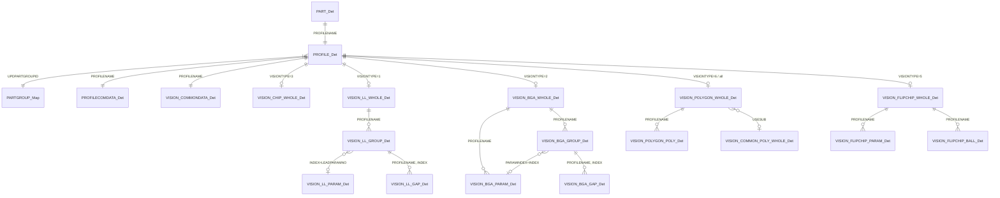

# Hanwha/Samsung SM UPD.MDB – Footprint Geometry Research Report

**Workspace:** `C:\Users\Roriman\VALVET`  
**Database:** `examples/UPD.MDB`  
**Date:** 2026-08-28  
**Tool chain:** `user-access` MCP namespace + Access DAO (Jet/ACE)  

---

## 1. Executive Summary

`UPD.MDB` is a Hanwha/Samsung SM (SMT pick-and-place) machine component library. It is **not** a CAD footprint library: it stores **machine vision / placement profiles**, not copper land patterns. Geometry is stored as integer micrometers (1 unit = 1 µm = 0.001 mm) in a family of per-package-type tables keyed by `PROFILENAME`.  

A part → profile → geometry lookup works like this:

1. `PART_Det.PARTNAME` usually equals `PART_Det.PROFILENAME`.
2. `PROFILE_Det.PROFILENAME` gives the package group (`UPDPARTGROUPID`) and functional type (`FUNCTIONAL_TYPE_ID`).
3. `PARTGROUP_Map` maps the group to a `VISIONTYPE` (1 = leaded, 2 = BGA, 3 = chip, 4 = odd form, 5 = flip chip, 6 = polygon).
4. One of the `VISION_*` table families then holds the actual outline / lead / ball data.
5. `PROFILECOMDATA_Det` holds the overall footprint extents and height (`SIZEX`, `SIZEY`, `SIZEZ`).

To feed `VALVET` `FootprintOutlineMM` (in `src/pcb_preview/footprint_db.py`), the MDB data can be used for the **body outline** and **bounding box**, but the actual **pads** must be reconstructed from lead/ball parameters or fall back to IPC-style heuristics / KiCad import.

---

## 2. Unit Convention

All coordinate and dimension fields in the geometry tables are stored as **32-bit signed integers representing micrometers** (1 unit = 1 µm). Verified by real rows:

| Package | Field | Raw value | Real-world value |
|---|---|---|---|
| `_NewR1005` (metric 1005) | `TYPSIZEX` | 1000 | 1.0 mm |
| `_NewR1005` | `TYPSIZEY` | 500 | 0.5 mm |
| `_NewR2012` (metric 2012) | `TYPSIZEX` | 2000 | 2.0 mm |
| `_NewR2012` | `TYPSIZEY` | 1200 | 1.2 mm |
| `LQFP-100` | `TYPSIZEX` | 14000 | 14.0 mm body |
| `QFP-48` | `TYPSIZEX` | 7000 | 7.0 mm body |
| `_NewBGA` | `TYPSIZEX` | 27000 | 27.0 mm body |
| `_NewBGA` | `TYPBALLPITCHR` | 1270 | 1.27 mm pitch |

Convert to VALVET millimetres by dividing by 1000.

---

## 3. Relevant Table Catalog

| Table | Rows | Purpose | Geometry-bearing fields |
|---|---|---|---|
| `PART_Det` | 1689 | Component master list | `PARTNAME`, `PROFILENAME`, `PARTDESC`, `VENDORID` |
| `PROFILE_Det` | 1690 | Machine profile header | `PROFILENAME`, `UPDPARTGROUPID`, `FUNCTIONAL_TYPE_ID`, `PARENTPROFILE`, `VENDORID` |
| `PARTGROUP_Map` | 45 | Maps package group → vision type | `UPDPARTGROUPID`, `UPDPARTGROUPNAME`, `VISIONTYPE` |
| `PROFILECOMDATA_Det` | 1690 | Overall footprint & placement data | `SIZEX`, `SIZEY`, `SIZEZ`, `DEPTHZ`, `BODYCENX`, `BODYCENTY`, `POLARIZED`, `PIN1XPOS`, `PIN1YPOS`, `POFFSETX/Y/Z/R` |
| `VISION_COMMONDATA_Det` | 1690 | Camera / vision parameters | `VISIONNAME`, `USEPOLYGON`, `KINDOF`, `ALGORITHM`, `COMPONENT_WEIGHT`, `PIN1INDICATOR`, `PIN2INDICATOR` |
| `VISION_CHIP_WHOLE_Det` | 1155 | Chip / passive rectangular body | `TYPSIZEX`, `TYPSIZEY`, `MINSIZEX/Y`, `MAXSIZEX/Y`, `EXPARAM1..50` |
| `VISION_LL_WHOLE_Det` | 487 | Leaded package body (QFP, SOP, SOIC, connectors) | `TYPSIZEX`, `TYPSIZEY`, `LEADTYPE`, `LEADPARAMNUM`, `LEADGROUPNUM` |
| `VISION_LL_PARAM_Det` | 625 | Lead dimensions per parameter index | `INDEX`, `TYPWIDTH`, `TYPLENGTH`, `TYPPITCH`, `TYPFOOT`, `MIN/MAX` variants |
| `VISION_LL_GROUP_Det` | 1259 | Lead groups per side / row | `INDEX`, `ANGLE`, `RADCENTER`, `TANCENTER`, `LEADNUM`, `LEADPARAMNO`, `GAPNUM` |
| `VISION_LL_GAP_Det` | 5036 | Missing-lead ranges inside a group | `LGINDEX`, `INDEX`, `STARTNO`, `MISSLEADNUM` |
| `VISION_BGA_WHOLE_Det` | 39 | BGA body outline | `TYPSIZEX`, `TYPSIZEY`, `BALLPARAMCOUNT`, `BALLGROUPCOUNT`, `APPEARBALLSIZE` |
| `VISION_BGA_PARAM_Det` | 45 | Ball size / pitch per parameter index | `INDEX`, `TYPBALLDIA`, `TYPBALLPITCHR`, `TYPBALLPITCHT`, `RTOL`, `TTOL` |
| `VISION_BGA_GROUP_Det` | 45 | Ball grid groups | `INDEX`, `PARAMINDEX`, `GRIDTYPE`, `GRIDANGLE`, `NUMBALLSR`, `NUMBALLST`, `NUMMISSING` |
| `VISION_BGA_GAP_Det` | 240 | Missing ball blocks | `BGINDEX`, `INDEX`, `MISSBLOCKR`, `MISSBLOCKT`, `NUMMISSINGR`, `NUMMISSINGT` |
| `VISION_POLYGON_WHOLE_Det` | 1689 | Polygon body header (one row per profile; often empty) | `WIREFRAMEORIGINX/Y`, `WIREFRAMEANGLE`, `VERTEXNUM`, `BODYSIZEX`, `BODYSIZEY`, `USESUB` |
| `VISION_POLYGON_POLY_Det` | 5772 | Polygon vertices | `INDEX`, `VERTEXPOINTX`, `VERTEXPOINTY`, `ROUNDINGSIZE`, `SEGMENTANGLESPAN`, `CONTROLBIT`, `POLYGONGROUPINDEX` |
| `VISION_FLIPCHIP_WHOLE_Det` | 9 | Flip-chip body outline | `TYPSIZEX`, `TYPSIZEY`, `APPEARBALLSIZE` |
| `VISION_FLIPCHIP_PARAM_Det` | 9 | Flip-chip ball pitch / diameter | `INDEX`, `TYPBALLDIA`, `TYPBALLPITCHR/T` |
| `VISION_FLIPCHIP_BALL_Det` | 8876 | Individual flip-chip ball positions | `INDEX`, `POSITIONX`, `POSITIONY` |
| `VISION_COMMON_POLY_WHOLE_Det` | 9 | Shared polygon sub-shapes | `WHOLEINDEX`, `SHAPE`, `OPTION` |
| `VISION_COMMON_POLY_Det` | 36 | Shared polygon sub-shape vertices | `WHOLEINDEX`, `POLYINDEX`, `POINTX`, `POINTY`, `RADIUSX`, `RADIUSY`, `ANGLE_RADIUS` |
| `VISION_ODDFORM_WHOLE_Det` | 0 | Odd-form body placeholder | `TYPSIZEX`, `TYPSIZEY` (empty in this MDB) |
| `VISION_ODDFORM_PARAM_Det` | 0 | Odd-form lead/pad detail (empty in this MDB) | `TYPE`, `TYPSIZEX`, `TYPSIZEY`, `LEADTYPE`, etc. |
| `PART_FUNCTIONAL_TYPE_Map` | 0 | Functional type name dictionary (empty) | `FUNCTIONAL_TYPE_ID`, `FUNCTIONAL_TYPE_NAME`, `SHAPE_TYPE_ID` |
| `PART_VENDOR_Det` | 0 | Vendor dictionary (empty) | `VENDORID`, `VENDORNAME` |

Note: `HANDDATA_*`, `FEEDERTYPE_*`, `NOZZLETYPE_*`, `SPEED*` and `RANK_Det` tables are machine-specific placement data, not footprint geometry, and are omitted.

---

## 4. Column Dictionary (Geometry-Related Fields)

### `PART_Det`

| Column | Type | Meaning |
|---|---|---|
| `PARTNAME` | Text(32) | Component part number / user name. Usually the same as the profile name. |
| `PROFILENAME` | Text(50) | FK to `PROFILE_Det`. Where the footprint geometry lives. |
| `PARTDESC` | Text(255) | Human-readable description, often contains the real package (e.g. `SOIC-8`, `LQFP-64`). |
| `CONFIDENCE_LEVEL` | Integer | Data confidence flag. |
| `USED_MACHINE_SET` | Long | Machine-set bit mask. |
| `VENDORID` | Long | FK to `PART_VENDOR_Det` (empty in this MDB). |

### `PROFILE_Det`

| Column | Type | Meaning |
|---|---|---|
| `PROFILENAME` | Text(32) | Primary key string. Same as `PART_Det.PROFILENAME`. |
| `UPDPARTGROUPID` | Long | FK to `PARTGROUP_Map`. Decides which vision table family is used. |
| `FUNCTIONAL_TYPE_ID` | Long | Encoded package class (e.g. `10104` = chip, `20201` = SOP, `20300` = QFP, `30100` = BGA, `29000` = User IC). `PART_FUNCTIONAL_TYPE_Map` is empty, so the name must be inferred from the group or examples. |
| `PARENTPROFILE` | Text(50) | Reference to a base/template profile. Often blank; children may inherit the parent's name without having geometry rows of their own. |
| `MACHINE` | Long | Machine-availability bitmask. |
| `VENDORID` | Long | Always `0` in this MDB. |

### `PARTGROUP_Map` (decodes `UPDPARTGROUPID` → vision table family)

| VISIONTYPE | Package family | Geometry tables |
|---|---|---|
| 0 | `NONE` | None (no vision data). |
| 1 | Leaded: SOP, QFP, SOIC, PLCC, User IC, connector, etc. | `VISION_LL_*` |
| 2 | BGA / LGA / Multi-BGA | `VISION_BGA_*` |
| 3 | Chips: resistors, capacitors, LEDs, MELF, trimmers, etc. | `VISION_CHIP_WHOLE_Det` |
| 4 | Odd Form (custom mechanical parts) | `VISION_ODDFORM_*` (empty here) |
| 5 | Flip Chip / LGA | `VISION_FLIPCHIP_*` |
| 6 | Polygon (custom body outlines) | `VISION_POLYGON_*` |

### `PROFILECOMDATA_Det` (overall footprint extents & placement)

| Column | Type | Meaning |
|---|---|---|
| `SIZEX` | Long | Overall footprint X extent (µm). For leaded packages this includes the leads; for chips it equals the body. |
| `SIZEY` | Long | Overall footprint Y extent (µm). |
| `SIZEZ` | Long | Component thickness / height (µm). |
| `DEPTHZ` | Long | Placement depth offset (µm). |
| `BODYCENX`, `BODYCENTY` | Long | Body centroid offset from origin (µm). Usually zero. |
| `POLARIZED` | Boolean | True if pin-1 polarity matters. |
| `PIN1XPOS`, `PIN1YPOS` | Long | Pin-1 position relative to origin (µm). Usually zero. |
| `POFFSETX`, `POFFSETY`, `POFFSETZ`, `POFFSETR` | Long | Pick-point offset from centroid. |
| `CAD_CENTROID_OFFSET_X/Y/R` | Long | Centroid correction vs. CAD (µm / deg). |
| `FEEDERPITCH` | Long | Tape feeder pitch (µm). |
| `FEEDERID` | Long | Default feeder ID. |
| `UPDNOZZLETYPE` | Long | Nozzle type index. |
| `USE_SVS`, `SVS_TOLERANCE*` | Boolean/Long | Side-vision sensor height check settings. |
| `LCR_*` | Long | In-line component check (LCR meter) settings. |

### `VISION_CHIP_WHOLE_Det` (chip / passive packages)

| Column | Type | Meaning |
|---|---|---|
| `TYPSIZEX`, `TYPSIZEY` | Long | Nominal body size X/Y (µm). |
| `MINSIZEX`, `MAXSIZEX`, `MINSIZEY`, `MAXSIZEY` | Long | Min/max body size for vision tolerance (µm). |
| `EXPARAM1` | Long | Vision algorithm selector (`3` = chip body; `10` = transistor/diode lead inspect). |
| `EXPARAM2` | Long | Body-area / contrast threshold (e.g. `110`). |
| `EXPARAM3` | Long | Tangent tolerance (e.g. `30`). |
| `EXPARAM5` | Long | Repeat / threshold (e.g. `10`). |
| `EXPARAM6` | Long | Large constant (e.g. `1000000`) – likely internal scale factor. |
| `EXPARAM11`, `EXPARAM12` | Long | Lead **thickness** (µm) on left / right side. Unused extra slots are not stored as 0×0; the count is 0. |
| `EXPARAM13`, `EXPARAM14` | Long | Lead **length** (µm) on left / right (along X). |
| `EXPARAM15`, `EXPARAM16` | Long | Lead **count** on left / right. Chip-R/C = `0`/`0`. SOD = `1`/`1`. SOT-23 = `1`/`2`. SOT-23-5 = `2`/`3`. SOT-23-6 = `3`/`3`. |
| `EXPARAM18`, `EXPARAM19` | Long | First-to-last lead span (µm) on left / right (`0` if that side has one lead). Adjacent pitch = span / (count−1). |
| `EXPARAM31` | Long | Possibly pad-span or footprint size hint (varies by chip). |
| `AREAMARGINY` | Long | Area margin / vision window. |
| `OFFSETTOLERANCE` | Long | Placement offset tolerance (µm). |
| `PITCHCHECK`, `POSITIONCHECK`, `PRESENCECHECK`, `TIPDEVCHECK` | Boolean | Vision inspection flags (all false for chips). |

### `VISION_LL_WHOLE_Det` (leaded body)

| Column | Type | Meaning |
|---|---|---|
| `TYPSIZEX`, `TYPSIZEY` | Long | Nominal body size X/Y (µm). |
| `LEADTYPE` | Long | Lead style (e.g. `0` = gull-wing). |
| `LEADPARAMNUM` | Long | Number of distinct parameter rows in `VISION_LL_PARAM_Det`. |
| `LEADGROUPNUM` | Long | Number of lead groups (= sides) in `VISION_LL_GROUP_Det`. |
| `AREAMARGIN` | Long | Vision inspection margin. |
| `OFFSETTOLERANCE` | Long | Placement offset tolerance. |
| `DIRROTATION` | Long | Package orientation / directional marker rotation (in degrees × 1000). |
| `THRESHOLD` | Long | Vision threshold. |

### `VISION_LL_PARAM_Det` (lead dimensions)

| Column | Type | Meaning |
|---|---|---|
| `INDEX` | Long | Parameter index; referenced by `VISION_LL_GROUP_Det.LEADPARAMNO`. |
| `TYPWIDTH` | Long | Nominal lead width (µm). |
| `TYPLENGTH` | Long | Nominal lead length (µm). |
| `TYPPITCH` | Long | Nominal lead pitch (µm). |
| `TYPFOOT` | Long | Nominal lead foot / heel length (µm). |
| `MIN/MAX*` variants | Long | Vision tolerances for the same dimensions. |
| `RADTOLERANCE`, `TANTOLERANCE` | Long | Radial / tangential tolerances. |
| `INSP_PIN_ALGORITHM` | Long | Inspection algorithm index. |
| `MAXBENT`, `MAXLIFT` | Long | Bent-lead / lifted-lead limits. |

### `VISION_LL_GROUP_Det` (lead groups per side)

| Column | Type | Meaning |
|---|---|---|
| `INDEX` | Long | Group index (0-based). |
| `ANGLE` | Long | Side/orientation code: observed values `0,1,2,3` for the four sides of QFPs; `1,3` for left/right of SOPs. Exact mapping to cardinal direction needs validation. |
| `RADCENTER` | Long | Radial distance from package centre to the lead row centreline (µm). |
| `TANCENTER` | Long | Tangential offset of the first lead from the side midpoint (µm). |
| `LEADNUM` | Long | Number of leads in this group. |
| `LEADPARAMNO` | Long | FK to `VISION_LL_PARAM_Det.INDEX`. |
| `GAPNUM` | Long | Number of missing-lead gaps in this group. |
| `PRESENCECHECK`, `POSITIONCHECK`, `PITCHCHECK`, `TIPDEVCHECK` | Long | Inspection flags. |

### `VISION_LL_GAP_Det` (missing lead ranges)

| Column | Type | Meaning |
|---|---|---|
| `LGINDEX` | Long | Gap index within the group. |
| `INDEX` | Long | FK to `VISION_LL_GROUP_Det.INDEX`. |
| `STARTNO` | Long | Starting lead number of the missing range. |
| `MISSLEADNUM` | Long | Number of consecutive missing leads. |

### `VISION_BGA_WHOLE_Det` / `VISION_BGA_PARAM_Det` / `VISION_BGA_GROUP_Det`

| Column | Table | Meaning |
|---|---|---|
| `TYPSIZEX`, `TYPSIZEY` | Whole | Body size (µm). |
| `BALLPARAMCOUNT`, `BALLGROUPCOUNT` | Whole | Number of ball-parameter and grid groups. |
| `APPEARBALLSIZE` | Whole | Ball size used for vision (µm). |
| `TYPBALLDIA`, `MINBALLDIA`, `MAXBALLDIA` | Param | Nominal ball diameter (µm). |
| `TYPBALLPITCHR`, `TYPBALLPITCHT` | Param | Ball pitch in row and column directions (µm). |
| `RTOL`, `TTOL` | Param | Row/column pitch tolerances. |
| `INDEX` | Param | Parameter index referenced by `VISION_BGA_GROUP_Det.PARAMINDEX`. |
| `GRIDTYPE`, `GRIDANGLE` | Group | Grid style and orientation. |
| `NUMBALLSR`, `NUMBALLST` | Group | Number of balls along row/column. |
| `NUMMISSING` | Group | Number of missing balls in this group. |
| `MISSBLOCKR`, `MISSBLOCKT`, `NUMMISSINGR`, `NUMMISSINGT` | Gap | Missing ball block definitions. |

### `VISION_POLYGON_WHOLE_Det` / `VISION_POLYGON_POLY_Det`

| Column | Table | Meaning |
|---|---|---|
| `WIREFRAMEORIGINX`, `WIREFRAMEORIGINY`, `WIREFRAMEANGLE` | Whole | Polygon origin and rotation (µm / deg × 1000). |
| `VERTEXNUM` | Whole | Number of vertices in the polygon. `0` means the polygon table is not used for this profile. |
| `BODYSIZEX`, `BODYSIZEY` | Whole | Optional body bounding box (µm). |
| `USESUB` | Whole | Whether a shared sub-polygon (`VISION_COMMON_POLY_*`) is used. |
| `INDEX` | Poly | Vertex sequence number. |
| `VERTEXPOINTX`, `VERTEXPOINTY` | Poly | Vertex coordinates (µm). |
| `ROUNDINGSIZE` | Poly | Corner radius (µm). |
| `SEGMENTANGLESPAN` | Poly | Arc span for rounded segments. |
| `CONTROLBIT` | Poly | Path control flag: observed `0` = start of a new contour, `5` = continue line to this vertex. |
| `POLYGONGROUPINDEX` | Poly | Contour / group index. |
| `RESERVE` | Poly | Internal checksum / type flags (not geometry). |

### `VISION_FLIPCHIP_*` / `VISION_COMMON_*`

`VISION_FLIPCHIP_BALL_Det` is the only table that stores **individual** ball/pad positions (`POSITIONX`, `POSITIONY`). `VISION_FLIPCHIP_PARAM_Det` gives the ball diameter and pitch, and `VISION_FLIPCHIP_WHOLE_Det` gives the body size. `VISION_COMMON_*` tables are shared sub-polygon fragments; in this MDB they contain only 9 whole shapes and 36 vertices, so they are rarely used.

---

## 5. ER Diagram (Text / Mermaid)



**Key relationship notes:**
- There are **no numeric foreign-key constraints**; joins are by `PROFILENAME` text.
- `PART_Det.PARTNAME` equals `PART_Det.PROFILENAME` in this MDB for every row, but `PROFILE_Det.PARENTPROFILE` points to a template profile for many children (e.g. `0402_…` parts reference `3301-002244`). The geometry rows are usually keyed by the **child** profile name, not the parent name.
- `VISION_POLYGON_WHOLE_Det` has one row per profile (1689 rows), but only a subset has `VERTEXNUM > 0`.
- `PART_FUNCTIONAL_TYPE_Map` and `PART_VENDOR_Det` are empty, so functional-type and vendor names are not available.

---

## 6. Sample Data Snippets

### 6.1 Chip / Passive Packages (VISIONTYPE=3)

| Profile | `VISION_CHIP` body (µm) | `PROFILECOMDATA` footprint (µm) | Height (µm) | Notes |
|---|---|---|---|---|
| `_NewR0402` (metric 0402) | 400 × 200 | 400 × 200 | — | 0.4 × 0.2 mm body. |
| `_NewR1005` (metric 1005) | 1000 × 500 | — | — | Same as imperial 0402. |
| `_NewR0603` (metric 0603) | 600 × 300 | — | — | 0.6 × 0.3 mm. |
| `_NewR2012` (metric 2012) | 2000 × 1200 | 2000 × 1200 | 500 | 2.0 × 1.2 mm; `EXPARAM31=2000`. |
| `0805_1uF_50V_X5R_10%` | 1983 × 1320 | — | — | Real 0805 capacitor. |
| `0402_43pF_50V_X5R_5%` | 400 × 200 | 400 × 200 | 200 | Same as `_NewR0402`. |

### 6.2 Leaded Package – SOIC-8 (`AT45DB161E-SSHF-T`, VISIONTYPE=1)

```text
PROFILECOMDATA_Det:   SIZEX=4900, SIZEY=6100, SIZEZ=1400
VISION_LL_WHOLE_Det:  TYPSIZEX=4900, TYPSIZEY=3900, LEADTYPE=0, LEADGROUPNUM=2, LEADPARAMNUM=1
VISION_LL_GROUP_Det:  INDEX=0  ANGLE=3  RADCENTER=2500  TANCENTER=0  LEADNUM=7  LEADPARAMNO=0
                      INDEX=1  ANGLE=1  RADCENTER=2500  TANCENTER=0  LEADNUM=7  LEADPARAMNO=0
VISION_LL_PARAM_Det:  INDEX=0  TYPWIDTH=400  TYPLENGTH=1100  TYPPITCH=1270  TYPFOOT=500
```

Interpretation: 7 pins on each of two opposing sides; body 4.9 × 3.9 mm; full footprint 4.9 × 6.1 mm; lead width 0.4 mm, length 1.1 mm, pitch 1.27 mm, foot 0.5 mm.

### 6.3 Leaded Package – QFP-48 (VISIONTYPE=1)

```text
PROFILECOMDATA_Det:   SIZEX=9000, SIZEY=9000, SIZEZ=1400
VISION_LL_WHOLE_Det:  TYPSIZEX=7000, TYPSIZEY=7000, LEADGROUPNUM=4, LEADPARAMNUM=1
VISION_LL_GROUP_Det:  4 groups, each ANGLE=0/3/2/1, RADCENTER=4000, TANCENTER=0, LEADNUM=12
VISION_LL_PARAM_Det:  INDEX=0  TYPWIDTH=200  TYPLENGTH=1000  TYPPITCH=500  TYPFOOT=400
```

Interpretation: 48 leads, 12 per side, body 7 × 7 mm, full footprint 9 × 9 mm, 0.5 mm pitch, 0.2 mm lead width, 1.0 mm lead length, 0.4 mm foot.

### 6.4 BGA – `_NewBGA` (VISIONTYPE=2)

```text
PROFILECOMDATA_Det:   SIZEX=27000, SIZEY=27000, SIZEZ=2120
VISION_BGA_WHOLE_Det: TYPSIZEX=27000, TYPSIZEY=27000, BALLPARAMCOUNT=1, BALLGROUPCOUNT=0, APPEARBALLSIZE=500
VISION_BGA_PARAM_Det: INDEX=0  TYPBALLDIA=800  TYPBALLPITCHR=1270  TYPBALLPITCHT=1270  RTOL=30  TTOL=30
VISION_BGA_GROUP_Det: INDEX=0  PARAMINDEX=0  GRIDTYPE=1  NUMBALLSR=20  NUMBALLST=20  NUMMISSING=4
```

Interpretation: 27 × 27 mm body, 0.8 mm ball diameter, 1.27 mm pitch, 20×20 grid with 4 missing balls.

### 6.5 User IC (`_NewUserIC`, VISIONTYPE=1)

```text
PROFILE_Det:          UPDPARTGROUPID=14, FUNCTIONAL_TYPE_ID=29000, PARENTPROFILE="_M_LED-COVER_EIAJ-RRM"
PROFILECOMDATA_Det:   SIZEX=9800, SIZEY=5600, SIZEZ=6000
VISION_LL_WHOLE_Det:  TYPSIZEX=9800, TYPSIZEY=5000, LEADGROUPNUM=4, LEADPARAMNUM=2
VISION_LL_GROUP_Det:  INDEX=0  ANGLE=3  RADCENTER=2380  TANCENTER=-2450  LEADNUM=2  LEADPARAMNO=1
                      INDEX=1  ANGLE=1  RADCENTER=2380  TANCENTER=-2450  LEADNUM=3  LEADPARAMNO=0
                      INDEX=2  ANGLE=1  RADCENTER=2380  TANCENTER= 2450  LEADNUM=3  LEADPARAMNO=0
                      INDEX=3  ANGLE=3  RADCENTER=2380  TANCENTER= 2450  LEADNUM=2  LEADPARAMNO=1
VISION_LL_PARAM_Det:  INDEX=0  TYPWIDTH=350  TYPLENGTH=1300  TYPPITCH=1650  TYPFOOT=600
                      INDEX=1  TYPWIDTH=350  TYPLENGTH=1250  TYPPITCH=3300  TYPFOOT=600
```

Interpretation: Complex asymmetric lead arrangement (different lead counts and pitches on different sides), body 9.8 × 5.0 mm, full footprint 9.8 × 5.6 mm, height 6.0 mm. This is the kind of package the user highlighted as living in "User IC".

### 6.6 Polygon / Odd Package – `_NewShieldCan`

```text
VISION_POLYGON_WHOLE_Det:  VERTEXNUM=28, BODYSIZEX=18000, BODYSIZEY=18000, USESUB=0
VISION_POLYGON_POLY_Det:  28 vertices, e.g.
  INDEX=0  (-7335,  8180)  CONTROLBIT=0  -- start new contour
  INDEX=1  (-4335,  8180)  CONTROLBIT=5  -- line to
  INDEX=2  (-8335,  7180)  CONTROLBIT=0
  INDEX=3  (-8335,  4180)  CONTROLBIT=5
  ...
```

Interpretation: Custom shield-can body outline with multiple rectangular cutouts. The `CONTROLBIT` pattern `0,5,0,5,…` indicates new contour / continue contour. No pad information is stored in the polygon tables.

---

## 7. Recommendation: Mapping to `VALVET` `FootprintOutlineMM`

`FootprintOutlineMM` fields: `lines`, `circles`, `pads`, `bbox`, `source`. All values in millimetres.

| VALVET Field | Source in UPD.MDB | Conversion / Logic |
|---|---|---|
| `bbox` (min/max x/y) | `PROFILECOMDATA_Det.SIZEX`, `SIZEY` (or generated geometry) | Divide by 1000. For leaded packages `SIZEX`/`SIZEY` already include the leads; for chips it equals the body. Use `union_bbox` of all generated primitives as a fallback. |
| `lines` (body rectangle) | `VISION_LL_WHOLE_Det.TYPSIZEX`, `TYPSIZEY` for leaded packages; `VISION_CHIP_WHOLE_Det.TYPSIZEX`, `TYPSIZEY` for chips; `VISION_POLYGON_POLY_Det` vertices for polygon packages. | Convert µm → mm; draw rectangle or polyline from vertices. For rounded corners use `ROUNDINGSIZE`. |
| `circles` (BGA/flip-chip balls) | `VISION_BGA_PARAM_Det.TYPBALLDIA` / `VISION_FLIPCHIP_BALL_Det.POSITIONX/Y` | Diameter → radius; place at grid positions or use per-ball coordinates. |
| `pads` (leaded packages) | `VISION_LL_GROUP_Det` + `VISION_LL_PARAM_Det` | Generate one `PadRectMM` per lead. Place along each side using `ANGLE`, `RADCENTER`, `TANCENTER`, `LEADNUM`, `TYPPITCH`. Pad size = `TYPWIDTH` × `TYPLENGTH`. Rotation matches the side angle. Remove pads listed in `VISION_LL_GAP_Det`. |
| `pads` (BGA) | `VISION_BGA_GROUP_Det` + `VISION_BGA_PARAM_Det` | Generate a grid of circular pads from `NUMBALLSR`, `NUMBALLST`, `TYPBALLPITCHR/T`, `TYPBALLDIA`. Remove blocks described in `VISION_BGA_GAP_Det`. |
| `pads` (chips) | **Not stored in MDB.** | Use the existing `heuristic_footprint_outline()` from `footprint_db.py` (two rectangular pads sized by the body), or import a true KiCad footprint. |
| `pads` (polygon / odd form) | **Not stored in MDB.** | Use the body outline as the `lines` portion and rely on KiCad import for the actual pads. |
| `source` | — | Set to a new value such as `"hanwha_upd"` when the outline comes from the MDB; otherwise keep `"heuristic"` or `"kicad_mod"`. |

### 7.1 Suggested `FootprintStore` integration

The current `FootprintStore.lookup_outline()` chain is:

```text
db key → alias → heuristic_footprint_outline()
```

A new tier can be inserted before the heuristic:

```text
MDB lookup (PART_Det → PROFILE_Det → VISIONTYPE → geometry tables)
        ↓
geometry builder → FootprintOutlineMM
        ↓
heuristic / KiCad fallback
```

Add a builder module (e.g. `pcb_preview/upd_mdb_geometry.py`) that:

1. Opens `UPD.MDB` once (or on change) via a small DAO wrapper.
2. Resolves `PARTNAME` → `PROFILENAME` (or `PARENTPROFILE` if no child rows).
3. Reads `PROFILE_Det` and `PARTGROUP_Map` to choose the VISION family.
4. Builds the outline with the rules in the table above.
5. Returns `FootprintOutlineMM(source="hanwha_upd")`.

Because `footprint_db.py` stores `outline_json` as JSON, the builder can be called on cache miss and the result persisted in `footprints.sqlite3` exactly like the existing heuristics.

---

## 8. Gaps & What Still Needs Heuristic / KiCad Import

1. **No human-readable type names** – `PART_FUNCTIONAL_TYPE_Map` is empty and `PART_VENDOR_Det` is empty. `FUNCTIONAL_TYPE_ID` codes must be inferred from `PARTGROUP_Map` or hard-coded.

2. **No true copper pad geometry** – The MDB stores **vision leads**, not land-pattern pads. Pad width, length, and toe/heel offsets are only approximate.

3. **Chip-R/C lands are absent** – resistor/capacitor rows have `EXPARAM15`/`16` = 0; two end pads stay heuristic. **TR2 / SOD / SOT-23-n** encode lead slots in `EXPARAM11`–`16` and `18`/`19` (counts, not `VISION_LL_*`). Copper land offset is still approximate.

4. **Leaded coordinate convention is undocumented** – `ANGLE`, `RADCENTER`, `TANCENTER` need to be reverse-engineered to produce correct pad positions. Pin-1 location and side order are not explicit.

5. **BGA missing-ball encoding is block-based** – `VISION_BGA_GAP_Det` describes missing blocks, but the exact grid origin, A1 corner, and rotation must be assumed.

6. **Polygon packages lack pads** – `VISION_POLYGON_*` only describes the body outline. For shield cans, connectors, etc., the pads are not in the MDB.

7. **Odd-form / flip-chip tables are sparse** – `VISION_ODDFORM_*` is empty in this MDB; flip-chip profiles exist but are few. Generic packages will still need the heuristic path.

8. **No courtyard / silkscreen line width** – The MDB provides `AREAMARGIN` values, but they are vision tolerances, not recommended courtyard lines. Use a fixed `width_mm` (e.g. `0.12`) as in `StrokeLineMM` defaults.

9. **Height only, not 3D shape** – `SIZEZ` gives a single thickness value; there is no full 3D model.

10. **Profile inheritance is not fully resolved** – Some child profiles point to `PARENTPROFILE` but have their own geometry rows; others may rely on the parent. A robust importer should try the child first, then fall back to the parent.

---

## 9. Quick Reference: VISIONTYPE → Table Family

| `VISIONTYPE` | `UPDPARTGROUPNAME` examples | Geometry tables |
|---|---|---|
| 0 | `NONE` | No geometry. |
| 1 | `SOP`, `QFP`, `SOJ`, `PLCC`, `Connector`, `User IC`, `Hemt`, `INSERT` | `VISION_LL_WHOLE_Det`, `VISION_LL_PARAM_Det`, `VISION_LL_GROUP_Det`, `VISION_LL_GAP_Det` |
| 2 | `BGA`, `Multi BGA` | `VISION_BGA_WHOLE_Det`, `VISION_BGA_PARAM_Det`, `VISION_BGA_GROUP_Det`, `VISION_BGA_GAP_Det` |
| 3 | `CHIP-*`, `TR`, `TR2`, `Melf`, `Trimmer`, `LED`, `LED PAD`, `Chip-R*`, `Chip-C*` | `VISION_CHIP_WHOLE_Det` |
| 4 | `Odd Form` | `VISION_ODDFORM_WHOLE_Det`, `VISION_ODDFORM_PARAM_Det` (empty here) |
| 5 | `Flip Chip` | `VISION_FLIPCHIP_WHOLE_Det`, `VISION_FLIPCHIP_PARAM_Det`, `VISION_FLIPCHIP_BALL_Det` |
| 6 | `Polygon` | `VISION_POLYGON_WHOLE_Det`, `VISION_POLYGON_POLY_Det` |

---

## 10. Appendix A – Observed `FUNCTIONAL_TYPE_ID` Codes

| Code | Typical package group | Example profile |
|---|---|---|
| `10104` | Chip resistor (metric 0402?) | `_NewC0402` |
| `10106` | Chip capacitor (metric 0402) | `0402_43pF_50V_X5R_5%` |
| `10108` | Chip 0805 | `0805_100uF_4V_X6S_20%` |
| `10109` | Chip 1206 | `1206_0.1uF_50V_X7R_10%` |
| `10209` | LED / special chip | `LED_white` |
| `10500` | LED (small) | `_NewLED`, `LED0603` |
| `10600` | Crystal | `_NewAluminum(CRYSTAL)` |
| `11200` | Rectangular crystal / large chip | `LED2835`, `_NewRect(CRYSTAL)` |
| `20101` | SOP / Small SOP | `_NewSOP`, `MSOP-8` |
| `20201` | SOP2 / TSOP | `TSSOP-14`, `TSOP54` |
| `20300` | QFP | `_NewQFP`, `LQFP-100`, `QFP-48` |
| `20400` | Connector | `_NewConnector` |
| `29000` | User IC | `_NewUserIC` |
| `30100` | BGA | `_NewBGA`, `i5-1334U_SRMLS` |
| `30102` | LGA / BGA tray | `LGA_4189P_A_TRAY` |
| `30400` | New flip-chip | `_NewFlipChip` |
| `39000` | Multi BGA | `_NewMultiBGA` |
| `40100` | Unassigned / unknown | — |

---

*End of report.*
